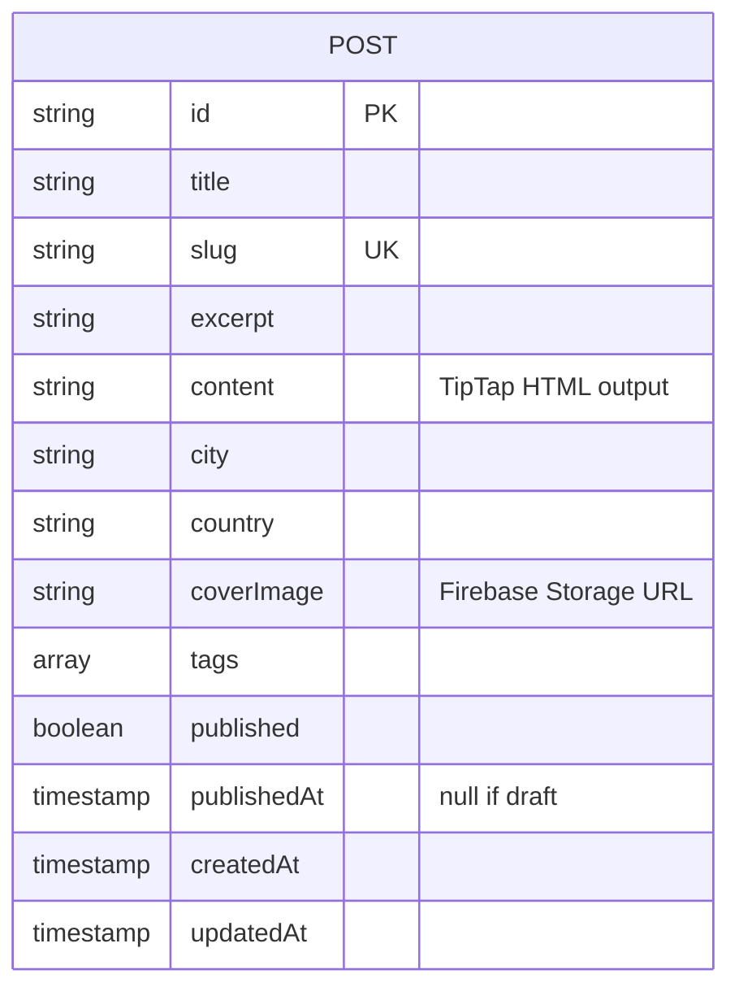
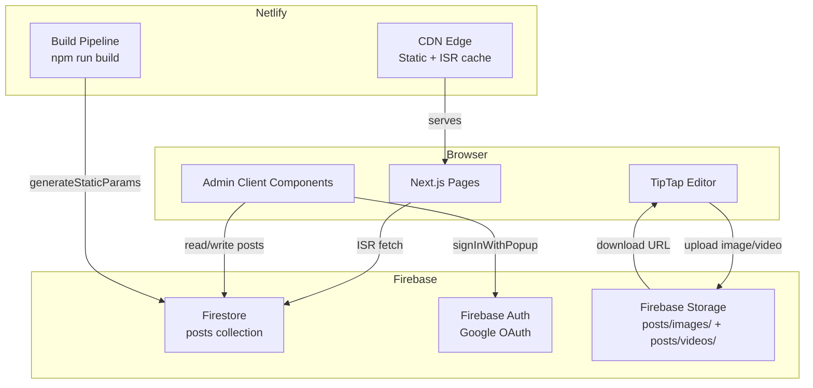
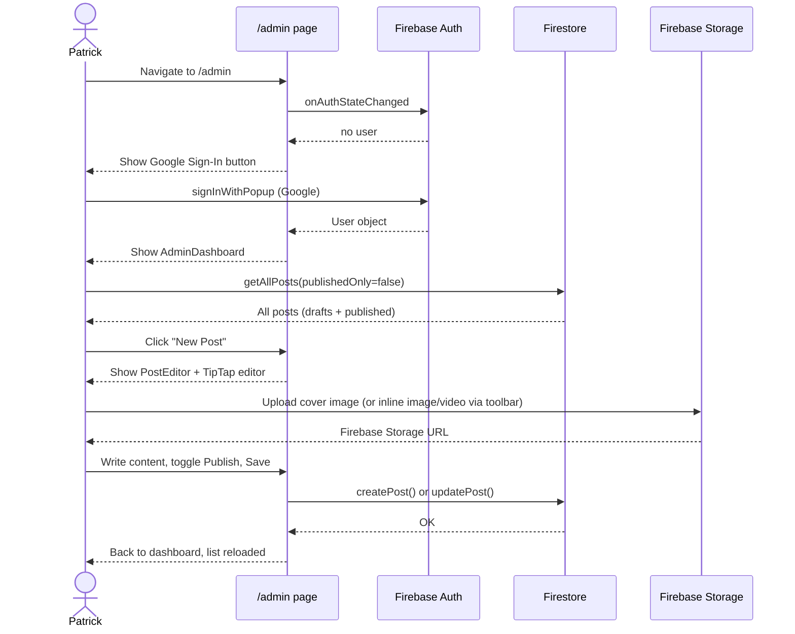
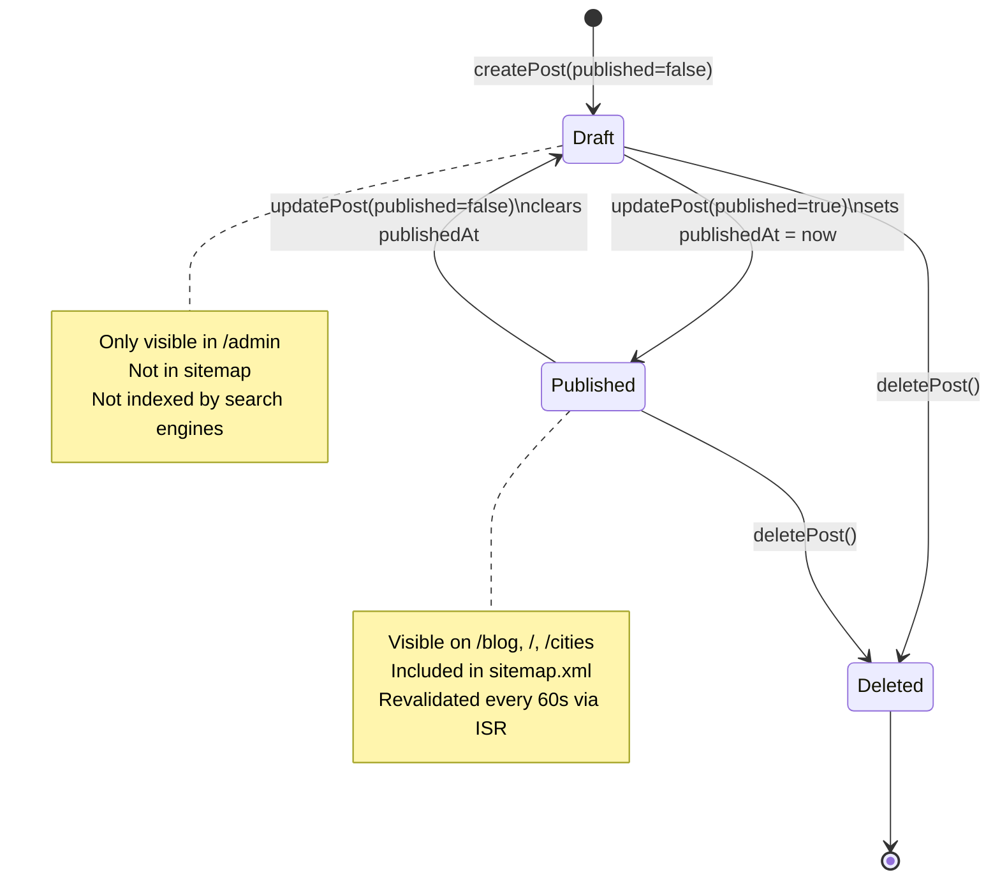

@AGENTS.md

# Wandering & Working — Travel Blog

Next.js 16 (App Router) travel blog + Firebase CMS. Patrick documents 2 years of remote work travel — deep-dives into cities lived in, not just visited. Variable posting cadence (daily for months in one place, or single posts per location).

**Pro features are planned later** (subscriptions, user accounts, city guides, gear lists) once content and audience are built. Don't add auth guards, paywalls, or user-facing complexity until explicitly asked.

---

## Stack

| Layer | Tech |
|---|---|
| Framework | Next.js 16 App Router, TypeScript |
| Styling | Tailwind CSS v4, Playfair Display (serif headings) + Inter (body) |
| Editor | TipTap (free MIT core) — rich text, image + video upload |
| Database | Firebase Firestore |
| Auth | Firebase Auth — Google Sign-In (admin only, popup flow) |
| Storage | Firebase Storage — post images + videos (`posts/images/`, `posts/videos/`) |
| Deploy | Netlify via GitHub, `@netlify/plugin-nextjs` |

---

## Environment

All Firebase config lives in `.env.local` (gitignored). Never commit this file.

```
NEXT_PUBLIC_FIREBASE_API_KEY
NEXT_PUBLIC_FIREBASE_AUTH_DOMAIN
NEXT_PUBLIC_FIREBASE_PROJECT_ID
NEXT_PUBLIC_FIREBASE_STORAGE_BUCKET
NEXT_PUBLIC_FIREBASE_MESSAGING_SENDER_ID
NEXT_PUBLIC_FIREBASE_APP_ID
NEXT_PUBLIC_FIREBASE_MEASUREMENT_ID
```

On Netlify: add these under **Site Settings → Environment Variables**.

---

## Routes

```mermaid
graph LR
    A[/] --> B[/blog]
    A --> C[/cities]
    A --> D[/about]
    B --> E[/blog/:slug]
    C --> F[/cities/:city]
    G[/admin] --> H{Authenticated?}
    H -- No --> I[Google Sign-In popup]
    H -- Yes --> J[AdminDashboard]
    J --> K[PostEditor - new]
    J --> L[PostEditor - edit]
```

| Route | Type | Revalidate | Indexed |
|---|---|---|---|
| `/` | ISR | 60s | Yes |
| `/blog` | ISR | 60s | Yes |
| `/blog/[slug]` | SSG + ISR | 60s | Yes |
| `/cities` | ISR | 60s | Yes |
| `/cities/[city]` | SSG + ISR | 60s | Yes |
| `/about` | Static | — | Yes |
| `/admin` | Client-only | — | **No** |
| `/api/*` | — | — | **No** |
| `/sitemap.xml` | Dynamic | — | — |

---

## Data Model

### Firestore Collection: `posts`



`content` is raw HTML produced by TipTap — rendered via `dangerouslySetInnerHTML` on the public post page. Images and videos inside content are Firebase Storage URLs (`` and `<video>` tags). The cover image is a separate top-of-post hero image.

**Firestore indexes** (deployed, see `firestore.indexes.json`):

| Fields | Use |
|---|---|
| `published ASC` + `publishedAt DESC` | All published posts sorted by date |

The city query (`getPostsByCity`) uses a single `where("city")` and sorts in JS — no composite index needed.

Deploy/update indexes: `firebase deploy --only firestore:indexes`

---

## Architecture



---

## Admin CMS Flow



---

## TipTap Editor

Rich text editor loaded client-side only (`dynamic` import, `ssr: false`). Located at `src/components/editor/`.

**Toolbar capabilities:**
- Headings H1 / H2 / H3
- Bold, Italic, Underline, Strikethrough
- Text align left / center / right
- Bullet list, Numbered list, Blockquote, Code block
- Link (prompt for URL)
- **Image upload** → Firebase Storage → inline `` in content
- **Video upload** → Firebase Storage → inline `<video controls>` in content
- Horizontal rule, Undo, Redo

All toolbar buttons have `type="button"` to prevent accidental form submission.

**Upload flow** (`src/lib/storage.ts`):
1. User clicks Image or Video button in toolbar
2. File picker opens
3. File uploads to `posts/images/{timestamp-random}.ext` or `posts/videos/...`
4. `getDownloadURL` returns the public URL
5. TipTap inserts `` or custom `<video src="...">` node at cursor

**Custom VideoNode** (`src/components/editor/VideoNode.ts`): TipTap node that renders as HTML5 `<video controls>` — both in the editor and in the public post output.

---

## Post Lifecycle



---

## File Structure

```
src/
├── app/
│   ├── layout.tsx              # Root layout — Navbar, Footer, global metadata + OG defaults
│   ├── page.tsx                # Homepage — hero, latest 3 posts, city pills
│   ├── globals.css             # Tailwind + .prose (public) + .prose-editor (TipTap) styles
│   ├── sitemap.ts              # Auto sitemap from Firestore
│   ├── blog/
│   │   ├── page.tsx            # All published posts grid
│   │   └── [slug]/page.tsx     # Individual post — per-post OG/Twitter meta
│   ├── cities/
│   │   ├── page.tsx            # City index — post count per city
│   │   └── [city]/page.tsx     # Posts filtered by city (in-memory filter+sort)
│   ├── about/page.tsx
│   └── admin/
│       ├── layout.tsx          # robots: noindex for entire /admin
│       ├── page.tsx            # Google Auth gate (signInWithPopup)
│       ├── AdminDashboard.tsx  # Post list + create/edit/delete
│       └── PostEditor.tsx      # Full post form — cover upload, TipTap editor, tags, publish toggle
├── components/
│   ├── Navbar.tsx              # Sticky top nav, mobile hamburger
│   ├── Footer.tsx
│   ├── PostCard.tsx            # Card with full-card link overlay (entire card is clickable)
│   └── editor/
│       ├── RichTextEditor.tsx  # TipTap editor wrapper (dynamic, no SSR)
│       ├── EditorToolbar.tsx   # Toolbar — all buttons have type="button"
│       └── VideoNode.ts        # Custom TipTap node for <video> embeds
└── lib/
    ├── firebase.ts             # Firebase init (singleton via getApps())
    ├── posts.ts                # Firestore CRUD — getAllPosts, getPostBySlug, getPostsByCity, getCities
    ├── storage.ts              # Firebase Storage upload — uploadAsset(file, "images"|"videos", onProgress)
    └── utils.ts                # formatDate, slugify, truncate
```

---

## Firebase Storage Rules

Storage must allow authenticated writes and public reads. Set in Firebase Console → Storage → Rules:

```
rules_version = '2';
service firebase.storage {
  match /b/{bucket}/o {
    match /{allPaths=**} {
      allow read: if true;
      allow write: if request.auth != null;
    }
  }
}
```

---

## SEO & Crawling

- `/admin/*` and `/api/*` are `noindex` via Next.js metadata API and `netlify.toml` response headers
- `robots.txt` blocks `/admin/` and `/api/` from all crawlers
- Each post page generates its own `<title>`, `description`, `og:*`, and `twitter:*` tags via `generateMetadata()`
- `sitemap.xml` is dynamically generated from all published posts + city pages
- Replace `yourdomain.com` in `layout.tsx`, `sitemap.ts`, and `robots.txt` once domain is live

---

## Deployment Checklist

- [x] Firebase CLI initialized (`firebase init firestore`)
- [x] Firestore indexes deployed (`firebase deploy --only firestore:indexes`)
- [ ] Add all `NEXT_PUBLIC_FIREBASE_*` vars to Netlify environment variables
- [ ] Add Netlify domain to Firebase Console → Authentication → Authorized Domains
- [ ] Replace `yourdomain.com` in `src/app/layout.tsx`, `src/app/sitemap.ts`, `public/robots.txt`
- [ ] Add OG default image at `public/og-default.jpg` (1200×630)
- [ ] Connect GitHub repo in Netlify dashboard → auto-deploys on push to main
