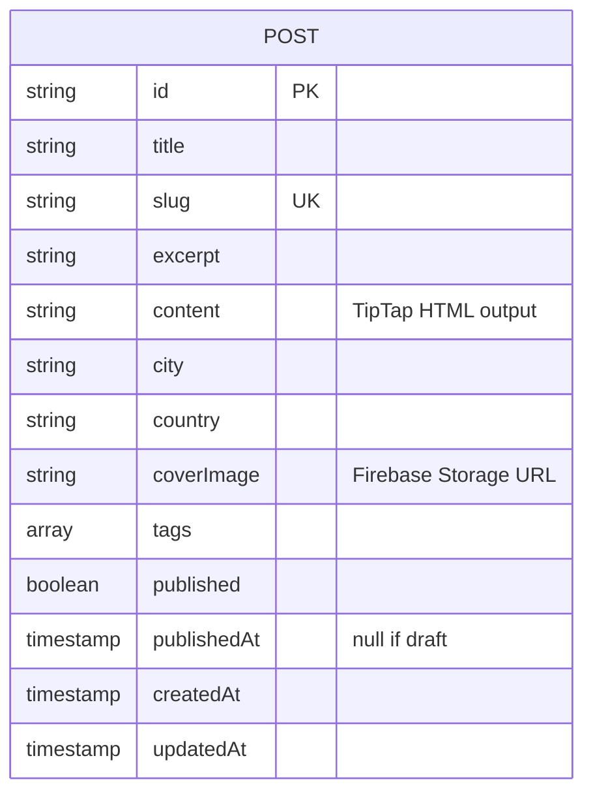
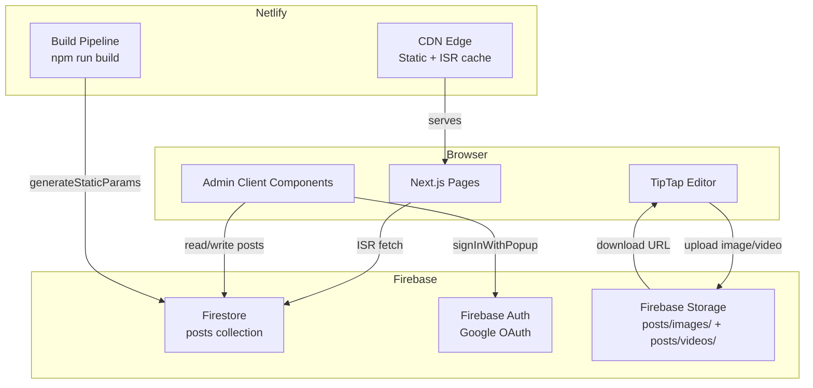
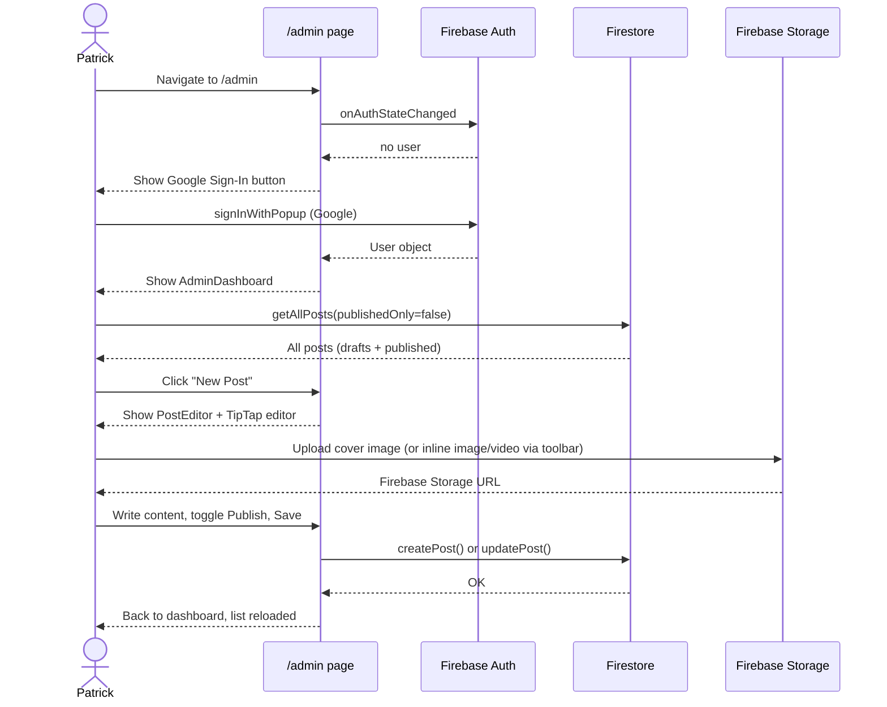
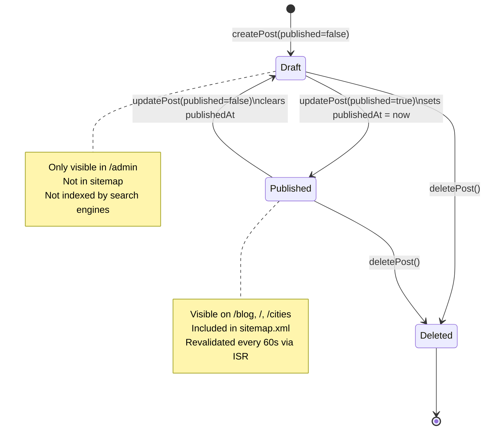

@AGENTS.md

# Wandering & Working — Travel Blog

Next.js 16 (App Router) travel blog + Firebase CMS. Patrick documents 2 years of remote work travel — deep-dives into cities lived in, not just visited. Variable posting cadence (daily for months in one place, or single posts per location).

**Pro features are planned later** (subscriptions, user accounts, city guides, gear lists) once content and audience are built. Don't add auth guards, paywalls, or user-facing complexity until explicitly asked.

---

## Stack

| Layer | Tech |
|---|---|
| Framework | Next.js 16 App Router, TypeScript |
| Styling | Tailwind CSS v4, Playfair Display (serif headings) + Inter (body) |
| Editor | TipTap (free MIT core) — rich text, image + video upload, captions, pull quotes, data tables |
| Database | Firebase Firestore |
| Auth | Firebase Auth — Google Sign-In (admin only, popup flow) |
| Storage | Firebase Storage — post images + videos (`posts/images/`, `posts/videos/`) |
| Animation | GSAP + ScrollTrigger — hero timeline, scroll-triggered fades |
| Deploy | Netlify via GitHub, `@netlify/plugin-nextjs` |

`functions/` exists but is the untouched Firebase template — no deployed functions. It's
CommonJS with its own `.eslintrc.js`, so the root ESLint config ignores it.

---

## Environment

All Firebase config lives in `.env.local` (gitignored). Never commit this file.

```
NEXT_PUBLIC_FIREBASE_API_KEY
NEXT_PUBLIC_FIREBASE_AUTH_DOMAIN
NEXT_PUBLIC_FIREBASE_PROJECT_ID
NEXT_PUBLIC_FIREBASE_STORAGE_BUCKET
NEXT_PUBLIC_FIREBASE_MESSAGING_SENDER_ID
NEXT_PUBLIC_FIREBASE_APP_ID
NEXT_PUBLIC_FIREBASE_MEASUREMENT_ID
```

On Netlify: add these under **Site Settings → Environment Variables**.

---

## Design System

Everything lives in `src/app/globals.css`. **Mobile is the primary target** — very
few readers are on desktop, so mobile is the base case and `sm:`/`lg:` are the
exceptions.

### Palette — use the tokens, never inline hex

`:root` defines the palette; `@theme` maps it to Tailwind utilities
(`text-ink`, `border-border`, `bg-raised`, `text-gold`…). Raw CSS reads
`var(--ink)`. There is **no inline hex anywhere in `src/`** — keep it that way.

| Token | Role |
|---|---|
| `--bg` | page ground |
| `--surface` | raised cards (warm white — pure `#fff` reads cold here) |
| `--raised` | image placeholders, inline code |
| `--border` | hairlines, dividers |
| `--ink` | headings, primary text |
| `--body` | long-form body copy |
| `--muted` | secondary text — **5.3:1 on `--bg`, passes WCAG AA** |
| `--faint` | **decorative only** — separators, placeholders. Never text. |
| `--gold` | accent on light grounds |
| `--gold-lift` | accent on dark grounds and over photography |

`--muted` was previously `#8a8074` at **3.7:1**, which failed AA for body-size
text. Don't lighten it back. `--faint` fails contrast by design — if you're
tempted to set text in it, use `--muted`.

### Type — scale dissonance, no middle register

The design leans on large serif display type against tiny letterspaced labels,
with **nothing in between**. A mid-size heading flattens the hierarchy and makes
the page read as unfinished rather than minimal.

- `.label` — 11px, `0.24em` tracking, uppercase, gold. Section heads and eyebrows.
- `.meta` — 11px, `0.14em` tracking, uppercase, muted. Dates, counts.
- Display/titles — `font-serif`, large, negative tracking, tight leading.

Serif is **Fraunces**, not Playfair Display. Playfair is a high-contrast Didone
whose hairlines go spindly below ~30px, which is exactly where card titles sit.
Fraunces carries an optical-size axis so it holds at both ends.

### Other conventions

- **`.grain`** — fixed noise overlay in the root layout, above everything,
  `pointer-events: none`. Deliberately *not* animated and *not* using
  `mix-blend-mode`; both are expensive to composite on mobile Safari.
- **Full-bleed media on phones** — `.prose img`/`figure`/`video` get
  `margin-inline: -1.25rem` under 640px to break the text column. That value
  matches the `px-5` page padding, so **changing page padding means changing
  this**. Captions get the padding back so they stay in the text column.
- **Data tables** are semantic `<table>` styled as spec blocks: hairline rules,
  header as a label, last column right-aligned with `tabular-nums`.
  `table-layout: auto` plus wrapping cells means they fit 390px without a
  horizontal scroller.
- **Reduced motion** — every GSAP component early-returns on
  `prefers-reduced-motion`, and the CSS block kills the hero marquee (a JS guard
  can't stop CSS keyframes).
- **Touch targets** — interactive pills and buttons carry `min-h-11`/`min-h-12`.
- **`Image` with `fill` always needs `sizes`.** Without it Next assumes `100vw`
  and over-fetches on every multi-column breakpoint.

---

## Routes

```mermaid
graph LR
    A[/] --> B[/blog]
    A --> C[/cities]
    A --> D[/about]
    B --> E[/blog/:slug]
    C --> F[/cities/:city]
    G[/admin] --> H{Authenticated?}
    H -- No --> I[Google Sign-In popup]
    H -- Yes --> J[AdminDashboard]
    J --> K[PostEditor - new]
    J --> L[PostEditor - edit]
```

| Route | Type | Revalidate | Indexed | Presentation |
|---|---|---|---|---|
| `/` | ISR | 60s | Yes | Hero + card grid (`PostGrid`, capped at 9) |
| `/blog` | ISR | 60s | Yes | **Dense archive** grouped by year (`ArchiveList`) |
| `/blog/[slug]` | SSG + ISR | 60s | Yes | Cover hero, `.prose` body, byline |
| `/cities` | ISR | 60s | Yes | **Chronological route** — numbered stops (`01`, `02`…) |
| `/cities/[city]` | SSG + ISR | 60s | Yes | Card grid filtered to one city |
| `/about` | Static | — | Yes | |
| `/admin` | Client-only | — | **No** | |
| `/api/*` | — | — | **No** | |
| `/sitemap.xml` | Dynamic | — | — | |

**`/` and `/blog` deliberately differ.** Cards are a showcase format — right on the
homepage where the job is selling three posts. The archive's job is the opposite:
fit as many entries on screen as possible while staying scannable, so it uses
compact rows with a thumbnail. Both formats exist; don't unify them.

**`/cities` is ordered by `firstAt` ascending — the sort order IS the narrative.**
Stops are numbered from the start of the journey, so the current city sits at the
bottom. Fine at a handful of cities; revisit past ~20.

---

## Data Model

### Firestore Collection: `posts`



`content` is raw HTML produced by TipTap — rendered via `dangerouslySetInnerHTML` on the public post page. Images and videos inside content are Firebase Storage URLs (`` and `<video>` tags). The cover image is a separate top-of-post hero image.

**Firestore indexes** (deployed, see `firestore.indexes.json`):

| Fields | Use |
|---|---|
| `published ASC` + `publishedAt DESC` | All published posts sorted by date |

The city query (`getPostsByCity`) uses two equality filters (`published` + `city`) and sorts in
JS. Equality-only conjunctions are served by merging single-field indexes, so no composite index
is needed — add one only if the sort ever moves into Firestore via `orderBy`.

Deploy/update indexes: `firebase deploy --only firestore:indexes`

> Removing an index from `firestore.indexes.json` does **not** reliably delete it —
> deploy creates missing indexes. Drop unwanted ones in the Firebase Console.

### `src/lib/posts.ts` API

| Function | Returns | Notes |
|---|---|---|
| `getAllPosts(publishedOnly = true)` | `Post[]` | `publishedOnly=false` reads drafts — **authenticated callers only** |
| `getPostsByCity(city)` | `Post[]` | Exact, case-sensitive `where("city")` |
| `getPostBySlug(slug)` | `Post \| null` | Published only, so draft URLs 404 |
| `getCities()` | `CityEntry[]` | Per-city cover image + `firstAt`/`lastAt`, **ordered chronologically** |
| `distinctCities(posts)` | `{city, country, count}[]` | **Pure** — derives from posts you already hold, no read |

**`getCities()` date ranges come from `publishedAt`, a proxy for when you were
actually there.** Publish as you go and it's accurate; backfill an old post and
that city's range shifts and can reorder the `/cities` route. A dedicated
`arrivedAt`/`leftAt` on the post is the real fix if that becomes a problem.

**`getCities()` is chronological for the timeline; `Footer` sorts a copy by
`count`** for discovery. Two consumers, two orders — neither mutates the other.

### City names are the primary key, effectively

`getCities()` groups on the **exact** `p.city` string while `citySlug()`
lowercases. So `Vegas` and `vegas` become two timeline stops sharing one URL, and
`getPostsByCity` — case-sensitive — silently orphans whichever variant loses the
slug resolution. `generateStaticParams` also emits duplicate params.

Guards against this, all in the editor:
- Suggestion chips from `distinctCities()` so you pick rather than retype
- A case-clash warning offering the existing spelling
- `.trim()` on save (a trailing space splits a city just like casing does)

**The guards are preventive, not retroactive.** Existing bad data needs fixing by
hand in `/admin`. `distinctCities()` deliberately preserves exact strings rather
than merging case-insensitively, so a split stays *visible* instead of hidden.

Always use `citySlug()` from `src/lib/utils.ts` — never inline the expression.

---

## Architecture



---

## Admin CMS Flow



---

## TipTap Editor

Rich text editor loaded client-side only (`dynamic` import, `ssr: false`). Located at `src/components/editor/`.

**The extension list lives in `editor/extensions.ts`, not in the component.** It's
separated so `npm run verify:editor` can build the real schema headlessly — see
*Verifying the editor* below.

**Toolbar capabilities:**
- Headings H1 / H2 / H3
- Bold, Italic, Underline, Strikethrough
- Text align left / center / right
- Bullet list, Numbered list, Blockquote, Code block
- **Pull quote** — `<blockquote class="pull">`, styled large with no quote rule
- Link (prompt for URL)
- **Image upload** → Firebase Storage → inline `` in content
- **Video upload** → Firebase Storage → inline `<video controls>` in content
- **Caption** — adds a caption to the *selected* image; disabled otherwise
- **Table** — inserts 3×2 with a header row; row/column controls appear only
  while the cursor is inside a table
- Horizontal rule, Undo, Redo

All toolbar buttons have `type="button"` to prevent accidental form submission.

**Upload flow** (`src/lib/storage.ts`):
1. User clicks Image or Video button in toolbar
2. File picker opens
3. File uploads to `posts/images/{timestamp-random}.ext` or `posts/videos/...`
4. `getDownloadURL` returns the public URL
5. TipTap inserts `` or custom `<video src="...">` node at cursor

### Custom nodes

| File | Produces | Notes |
|---|---|---|
| `VideoNode.ts` | `<video controls>` | Atom block node |
| `PullQuote.ts` | `<blockquote class="pull">` | `priority: 200` so it claims `blockquote.pull` before StarterKit's Blockquote (100) sees it. Regular blockquotes still work for citations. |
| `CaptionedImage.ts` | `<figure><figcaption>` | Extends `@tiptap/extension-image` and **keeps the node name `"image"`**, so `setImage()` and every previously-stored bare `` keep working. |

**`CaptionedImage` caption is an attribute, not child content.** That keeps the
node an atom — the same shape stock Image had — which is what makes it
zero-migration. Consequence: the caption is edited by toolbar prompt rather than
typed inline, and **a captionless image must serialise to a bare ``**,
byte-identical to stock output, or re-saving an old post would rewrite its
content. There's a check for exactly that in `verify:editor`.

**StarterKit already bundles Link and Underline**, so it's configured with
`{ link: false, underline: false }` and the explicitly-configured versions are
added instead. Registering both made TipTap warn about duplicate extension names
and left it ambiguous which config won.

### Verifying the editor

`/admin` is behind Google auth *and* the editor is a `dynamic({ ssr: false })`
import, so none of it is reachable from a server request — you cannot curl it, and
a broken `parseHTML` silently corrupts stored content on re-save.

```bash
npm run verify:editor
```

Builds the real schema from `extensions.ts` and asserts node registration,
content expressions, and the serialisation round-trip. **It cannot test keyboard
behaviour, node views, or anything needing a DOM** — those still need a browser.
`scripts/loader.mjs` only exists to let Node resolve the project's extensionless
relative imports.

---

## Post Lifecycle



---

## File Structure

```
src/
├── app/
│   ├── layout.tsx              # Root layout — Navbar, Footer, global metadata + OG defaults
│   ├── page.tsx                # Homepage — hero, latest 3 posts, city pills
│   ├── globals.css             # Tailwind + .prose (public) + .prose-editor (TipTap) styles
│   ├── sitemap.ts              # Auto sitemap from Firestore
│   ├── blog/
│   │   ├── page.tsx            # All published posts grid
│   │   └── [slug]/page.tsx     # Individual post — per-post OG/Twitter meta
│   ├── cities/
│   │   ├── page.tsx            # Chronological route — numbered stops, cover photo, date range
│   │   └── [city]/page.tsx     # Posts filtered by city (in-memory filter+sort)
│   ├── about/page.tsx
│   └── admin/
│       ├── layout.tsx          # robots: noindex for entire /admin
│       ├── page.tsx            # Google Auth gate (signInWithPopup)
│       ├── AdminDashboard.tsx  # Post list + create/edit/delete; derives knownCities
│       ├── PostEditor.tsx      # Full post form — cover upload, TipTap editor, tags, publish toggle
│       └── CityCountryFields.tsx  # City/country inputs + suggestion chips + case-clash warning
├── components/
│   ├── Navbar.tsx              # Sticky top nav, mobile hamburger
│   ├── Footer.tsx              # ASYNC server component — reads getCities() for the Places column
│   ├── PageHeader.tsx          # Shared eyebrow + display title + subtitle
│   ├── PostCard.tsx            # Card: image above, text below. Full-card link overlay
│   ├── PostGrid.tsx            # Lead + two beside + even grid. Used by / only
│   ├── ArchiveList.tsx         # Dense rows grouped by year. Used by /blog only
│   ├── PostByline.tsx          # Author block at the foot of a post
│   ├── HeroSection.tsx         # Homepage hero — GSAP intro timeline + CSS city-name marquee
│   ├── FadeUp.tsx              # Wrapper: scroll-triggered fade/rise for one block
│   ├── AnimatedPostGrid.tsx    # Wrapper: staggers <article> children into view on scroll
│   └── editor/
│       ├── extensions.ts       # THE SCHEMA — kept out of the component so it's testable
│       ├── RichTextEditor.tsx  # TipTap editor wrapper (dynamic, no SSR)
│       ├── EditorToolbar.tsx   # Toolbar — all buttons have type="button"
│       ├── VideoNode.ts        # Custom node for <video> embeds
│       ├── PullQuote.ts        # Custom node for <blockquote class="pull">
│       └── CaptionedImage.ts   # Image + caption → <figure><figcaption>
└── lib/
    ├── firebase.ts             # Firebase init (singleton via getApps())
    ├── posts.ts                # Firestore CRUD + getCities/distinctCities
    ├── storage.ts              # Firebase Storage upload — uploadAsset(file, "images"|"videos", onProgress)
    └── utils.ts                # formatDate, formatDayMonth, formatDateRange, citySlug, slugify, truncate

scripts/
├── verify-editor.ts            # Headless schema + serialisation checks (npm run verify:editor)
├── loader.mjs                  # Resolve hook for extensionless imports (test tooling only)
└── register-loader.mjs
```

**`Footer` is an async server component in the root layout**, so it costs one
`getCities()` read per route render — including `/admin`. ISR absorbs it at 60s and
it's wrapped in `.catch(() => [])`, so a Firestore outage degrades the footer to
static links rather than breaking every page. Hardcode the Places list if that
read ever matters.

**Animation convention:** every GSAP component is a client component that wraps its tweens in
`gsap.context(() => {...}, ref)` and returns `ctx.revert()` from the effect. Keep this — without
the context/revert pair, tweens leak across navigations and ScrollTrigger instances pile up.
`AnimatedPostGrid` targets `<article>` children, which is why `PostCard` renders an `<article>`
root; changing that tag silently kills the stagger.

---

## Firestore Rules — the query constraint

`firestore.rules` scopes public reads to published posts:

```
allow read: if resource.data.published == true || request.auth != null;
```

**This changes how you write queries.** Firestore rules do not filter query results — they
reject any query the engine can't prove stays inside the rule. So every query that runs
unauthenticated must carry `where("published", "==", true)` or it fails outright with a
permission error. That includes ISR on the server, which reads with no auth context.

| Function | Filter | Runs as |
|---|---|---|
| `getAllPosts(true)` | `published == true` | unauthenticated (ISR) |
| `getPostsByCity` | `published == true` + `city` | unauthenticated (ISR) |
| `getPostBySlug` | `published == true` + `slug` | unauthenticated (ISR) |
| `getAllPosts(false)` | none — reads drafts | authenticated (`/admin` only) |

Filtering in JS *after* the fetch is not equivalent and will break: the query is rejected
before any documents come back. If `/cities/[city]` or `/blog/[slug]` ever goes blank in
production, a missing `published` filter is the first thing to check.

> **Outstanding:** writes are still `request.auth != null`, so any Google account that signs in
> can create, edit, and delete posts. Both `firestore.rules` and `storage.rules` need a uid
> check (`request.auth.uid == "<uid>"`), and `/admin` should gate on that same uid rather than
> merely on a user being present.

---

## Firebase Storage Rules

Storage must allow authenticated writes and public reads. Set in Firebase Console → Storage → Rules:

```
rules_version = '2';
service firebase.storage {
  match /b/{bucket}/o {
    match /{allPaths=**} {
      allow read: if true;
      allow write: if request.auth != null;
    }
  }
}
```

---

## SEO & Crawling

- `/admin/*` and `/api/*` are `noindex` via Next.js metadata API and `netlify.toml` response headers
- `robots.txt` blocks `/admin/` and `/api/` from all crawlers
- Each post page generates its own `<title>`, `description`, `og:*`, and `twitter:*` tags via `generateMetadata()`
- `sitemap.xml` is dynamically generated from all published posts + city pages
- Replace `yourdomain.com` in `layout.tsx`, `sitemap.ts`, and `robots.txt` once domain is live

---

## Deployment Checklist

> **See `NEXT_STEPS.md`** for the current outstanding work, known data-hygiene
> issues, and what still needs manual testing.


- [x] Firebase CLI initialized (`firebase init firestore`)
- [x] Firestore indexes deployed (`firebase deploy --only firestore:indexes`)
- [ ] Add all `NEXT_PUBLIC_FIREBASE_*` vars to Netlify environment variables
- [ ] Add Netlify domain to Firebase Console → Authentication → Authorized Domains
- [ ] Replace `yourdomain.com` in `src/app/layout.tsx`, `src/app/sitemap.ts`, `public/robots.txt`
- [ ] Add OG default image at `public/og-default.jpg` (1200×630)
- [ ] Connect GitHub repo in Netlify dashboard → auto-deploys on push to main
